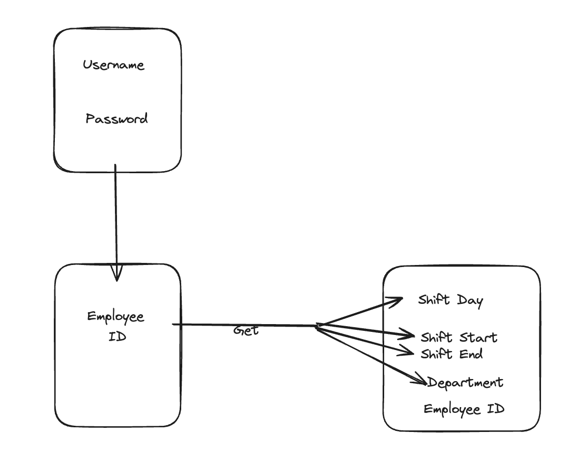
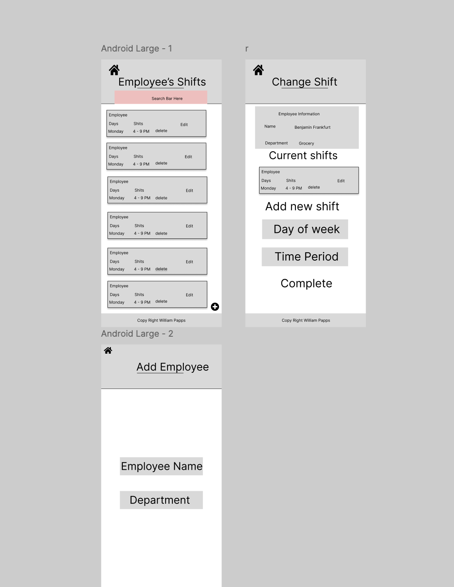
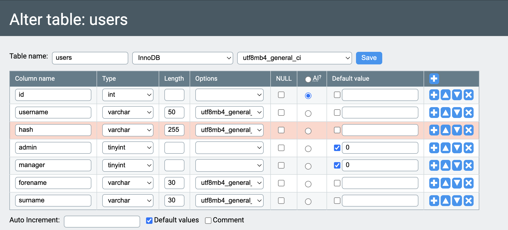
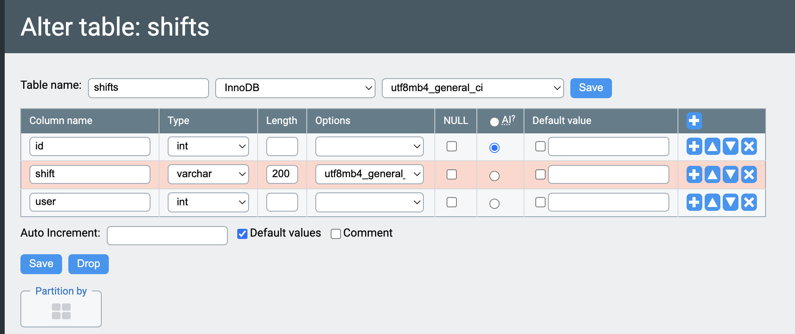

# The Design of a Database-Driven Web Application for NCEA Level 3

Project Name: **Retail Shift Management System**

Project Author: **William Papps**

Assessment Standards: **91902** and **91903**

-------------------------------------------------

## System Requirements

### Identified Need or Problem

A Retail Business needs to be able to have a simple system that allow's them to see their employee's shifts and manage them.

### End-User Requirements

The Retail Shift Managers and employees. These users will be workers, but also involved in what time they work. The clients want a  way to see and manage the shifts that their employees will be working so that they can prepare for the amount of work that will be done and need to be done as well as give new employees shift's in time's where they need more. They might do this via a mobile device, or a computer. Their IT skills could be weak, so they should be able to use my system without any training. They will likely want the site to have styling related to easy to understand and easy to use. The managers will be able to have some training to use the system, but even then the system should still be easy to use. They will mostly be using the system via the business computer. They will want the site to be very easy to use and straightforward and able to present the data cleanly. In terms of styling they could have it matching their style of business.

### Proposed Solution

A website for the Retail Business that allows the business manager to view employees shifts with editable data to manage when people are working. The website will also allow the manager to select certain employee's and edit when they're working.

Client should be able to

- View assigned shifts
- View others assigned Shifts

Managers should be able to 
- View employee's assigned shifts
- Edit and Manage employee's assigned shifts
- add new employees

-------------------------------------------------

## Relevant Implications

### Usability

The usability implications of a digital technology or digital outcome relate to how easy it is for the ender-use to use, without them needing any help or guidance while using it.The usability can be measured using Nielsen's 10 usability heuristics.

The usability implication is relevant to my retail project because every employee who wants to use the item will not be getting trained on how to use the website as there is too many people in the retail industry coming and going between jobs for example PAK'nSAVE has lots of students come and go every year and lots in the holidays. It is important that they're all able to use this resource without needing guidance so retail stores don't have to spend there time teaching each new individual.It is also important that the managers are able to use the resource with little to no help because it is very important for them to be able to easily change and mange their workers shifts.I need to ensure that every body in the retail industry is capable of using my resource even if they're not very good with using IT.

When developing my website I will need to consider using Nielsen's heuristics and try to make sure that the UI meets them as much as possible. Specifically, I will aim for a very clan and modern interface with a minimalistic design so there isn't to much to get overcomplicated with. The UI should be very basic and intuitive to use. Users should be able to easily see what shifts they are working or managers should easily be able to see there shifts and edit them. I will test my UI with my users and obtain feedback which will allow me to refine my design.

### Functionality

The functionality implications of a digital technology or digital outcome relate to how well it works for there end-user, in terms of does the resource/website meet the intended purpose and solve the user's need.

I will need to design my system to be as functional as possible since the clients of the retail stores will need my website to solve their problem/need of changing employee's shifts easily it needs to meet this purpose in order to be  a functional website and have no bugs as having bugs in the system could really screw up and interfere with the business and potentially mean that  nobody worked on one day due to a website bug. The website should work as expected from the users point of view it should have no hidden items that they're unaware of and should be straight forward.

As I create my system I will need to make sure that website is going to and does satisfy the original purpose/need for making it. I will aim for a very straight forward website that only solve's the purpose/need and doesn't have any unnecessary items to make the website feel chunky. I will aim to have the user's requirements met to the best that is possible. I will make sure that the system is able to cope with all inputs such as abnormal, normal and boundary I will make sure there is no errors for the user that will disturb there time using the website.

### Accessibility

The accessibility implications of a digital technology or digital outcome involve ensuring it is available and can be used by every end-user possible regardless of their limitations.

I will need to design my system to be as accessible as possible since the end-users will need my website this is relevant because there cant be people with impairments or limitations that means that they're unable to use the website. Every worker in the retail store needs access and able to use the website. The website should work as expected on any device of the end-users it should have no problems with using different devices.

As i design my website I will make sure that the colour and tone I combine will have good levels of contrast to help in accessing texts/icons/graphics I will make sure that the different colours used will not hurt anybody's eyes and will not make the website difficult to use if they're colour blind. I will have to make sure that the font and font size are readable as we don't want a too fancy font or too small font that some people are unable to read the words. The font will be straight forwards

-------------------------------------------------

## Relevant User Experience (UX) Principles

### Useful

Products and systems should be genuinely useful and fulfil a real need/purpose for the desired end-users.

If the website doesn't make it easy for clients to view a list of its employee's and their scheduled shifts, or if the site isn't easy to use and requires help, then it is clearly not a very useful site, and will most likely frustrate users. Frustrated users won't bother using the system and will revert to there older system or the one they're familiar with.

Right from the offset I will need to consult with my ender users to establish what they need from the system, and then make sure my design meets these needs. I need to extensively test the system with all the end users that will be using the system and get feedback about their experiences. Based towards their feedback I can judge whether they find the system useful or not and alter what needs to be changed to the system accordingly.

### Findable

Systems should be able to be easily navigated, so that end-users can find the content and complete tasks with the functionality and easiness they need and deserve.

Since the clients of the Retail business could potentially have no It skills this means that the system must be as simple to navigate as possible, with every function as clear as possible and findable.

I will need to consider how easily my system is to navigate in. I will need to make sure that my project will allow any end-user no matter what their skill level on IT is able to easily find and navigate through my website with minimal to no assistance This will impact my project by making sure there are no dead ends within the page and everything links together and you don't get stuck on a page. I can judge whether they find the system easily navigable based on their feedback and whether or not it needs to be changed.

### Valuable

The UX design principle Valuable means that it should be able to deliver value towards the business or organisation they represent. This could be monetary value, increased user engagement or saving there time.

The principle valuable is relevant to my project because the mangers of the retail stores need to be able to quickly change there employee's shifts and it needs to take as little amount of time possible.

During my project I will need to consider moving forward how much value the project actually provides which will mostly be looked at how much time the user spends using the website finding and doing what they need. I need to make sure that the end-user is able to change the employee's shifts/data as fast as possible to make it so they can save as much of their time as possible and spend it else where to better of their business. I can judge whether they find the system valuable as to how much time they spend doing their tasks.

-------------------------------------------------

## Final System Design

### Database Structure

### User Interface Design

-------------------------------------------------

## Completed System

### Database Structure

### User Interface Design

[Place screenshots and notes here that show your *actual system UI* in action.](https://youtu.be/A0dFfiXMiEY)
Youtube link showing a video of functionality of my system.

-------------------------------------------------

## Review and Evaluation

### Meeting the Needs of the Users

The end product that I have made meets the user requirements because the website has a very easy to use design and uses features from all the heuristics that I choose to implement into the website. The end user is able to easily use and manage the features in the website and teach others. It meets the specific tasks that the managers needed to be able to do and the system meets their needs entirely.

### Meeting the System Requirements

Replace this text with a brief evaluation of how well you met the requirements that you defined at the start of the project, etc. Look back at the list of features / functionality you initially set and discuss how well your system has implemented each one.

Tge requirements and features that I defined at the start of the project summed up where to have the website be able to be easiy used by anyone with little to no training and the features were that It needed to be able to add and remove shifts from employees also needed the feature to be able to view what employee's have what shifts. My website has used these features very effectively and they work smoothly and dont require help. Managers are able to manipulate their employees shift very fast and easily.

### Review of Accessibility

To make sure that I used the accessibility heuristic I choose colours that were easy to use and didnt have to high of contrast between each other and didnt blind the user. The color's allowed links and buttons to stand out from the rest of the page to make sure that the page was able to be navigated easily. I made sure that the font size was easily readable and anybody would be able to read the words without difficulty .

### Review of Usability

Replace this text with brief notes showing how the implication was addressed in the final outcome. Accompany the notes with screenshots / other media to illustrate specific features.

This implication was used in the final outcome of the website because I made sure that the page was easily to be used and that anybody who had access to it could use any function on the website without teaching as their was minimal options use and every button and link was straight forward and told you exactly what is was doing or where it was going to take you.

### Review of Functionality

This implication was definintely used because the functionality of the website works how intended the users are easily able ot view and edit theirs shifts on the website without any problems meeting the required functionality from my end user.

### Review of Useful

The UX principle of useful was addressed in the final outcome of my website by making sure that the website intendeda  real need/purpose on my website for the desired end-user I made sure that the website complted the problem and need of managers wanting to change, add or edit their employees shift without hassle I made sure that my website completed this task and was easily able to be used.

### Review of Findable

I made sure the UX principle findable was addressed in the final outcome. by making sure that the website was able to be easily navigated and you could traverse between pages without prbolems and go back to pages with ease if misclicked. I made sure the navigation was as simple as possible and used php routing system to help complete this I made sure every link and butotn  that leads you somewhere was obvious as to what it would do and where it would take you. I also kept the navigation bar fairly small to prevent cluttering.

### Review of Valuable

Replace this text with brief notes showing how the UX principle was addressed in the final outcome. Accompany the notes with screenshots / other media to illustrate specific features.

I made sure the UX principle valuable was addressed in the final outcome of my website by making sure that the website delivered value towards the organisation/end-user that was using it. I made sure that the website would be fast to use so that the users could save more of their time and spend it else where to further improve their company. I made sure to do this by making it as fast as possible to change and add the shifts of their employees.

